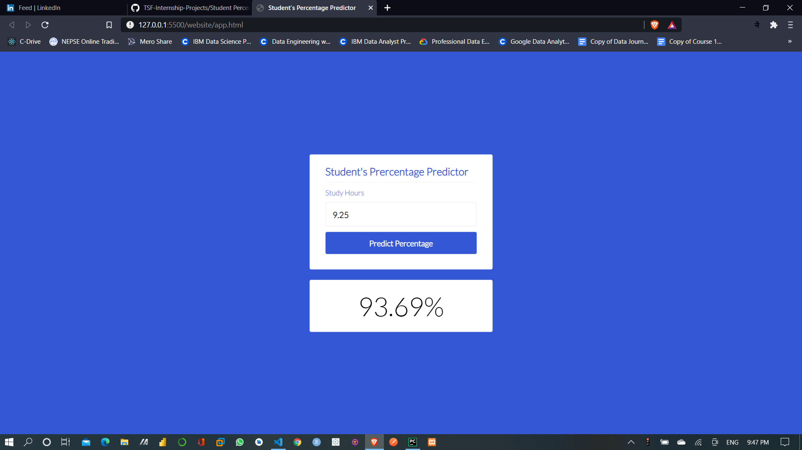

# Task 1: Predict the percentage of a student based on the no. of study hours.

This is a simple regression task where we have to find linear relationship between two variables i.e. HOURS and SCORES. And then we will be applying linear algorithm to predict the percentage scored based upon the number of study hours.

Step 1: Model Building

Step 2: Creating Python Flask Server

Step 3: Testing Server/REST API using POSTMAN

Step 4: Creating website to request to Server and display it in the web browser.

Dataset Link : (http://bit.ly/w-data)

